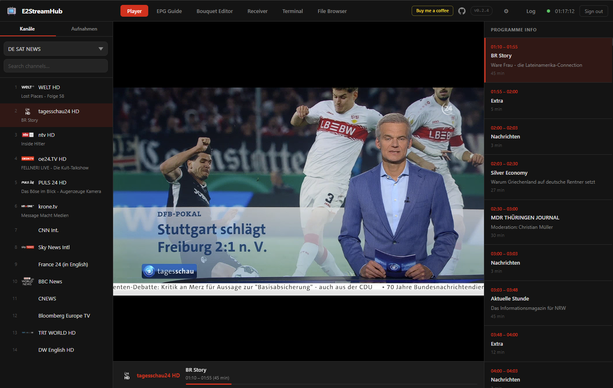
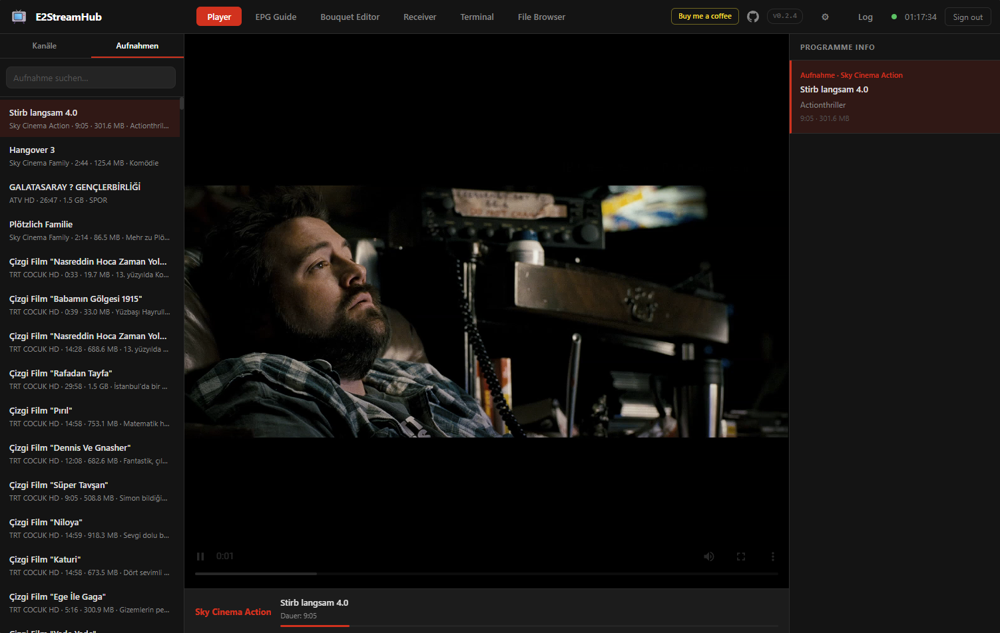
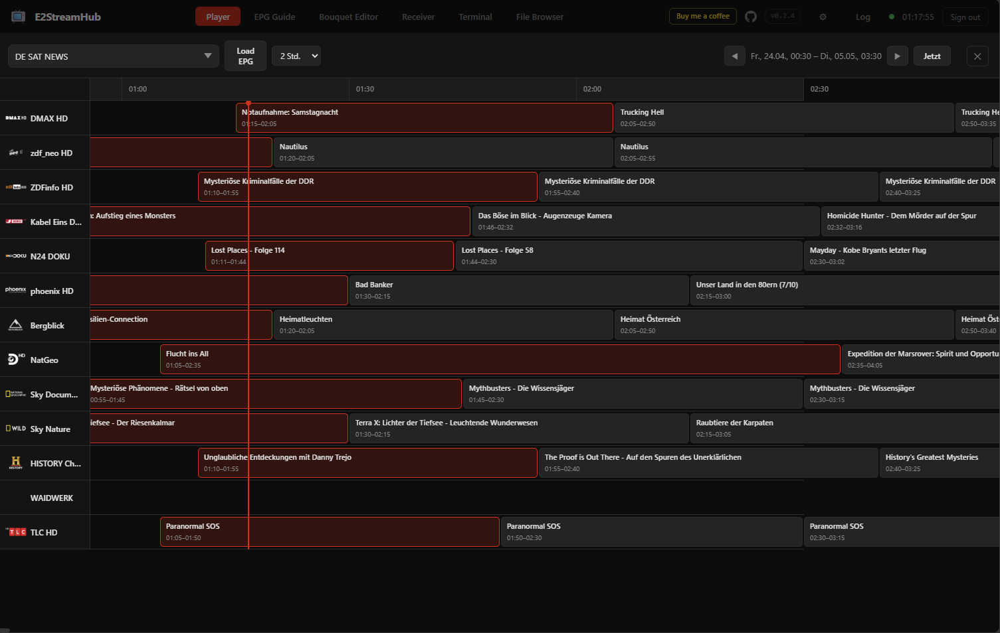
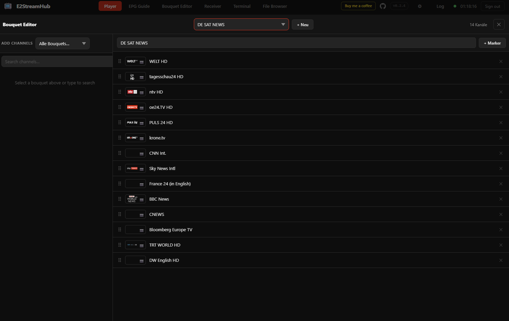
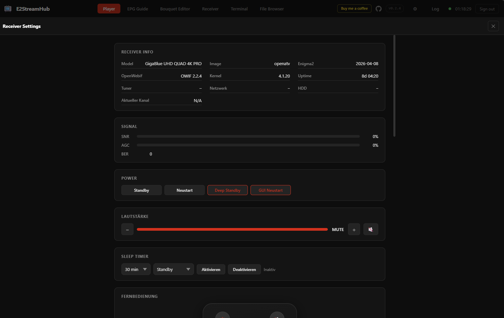
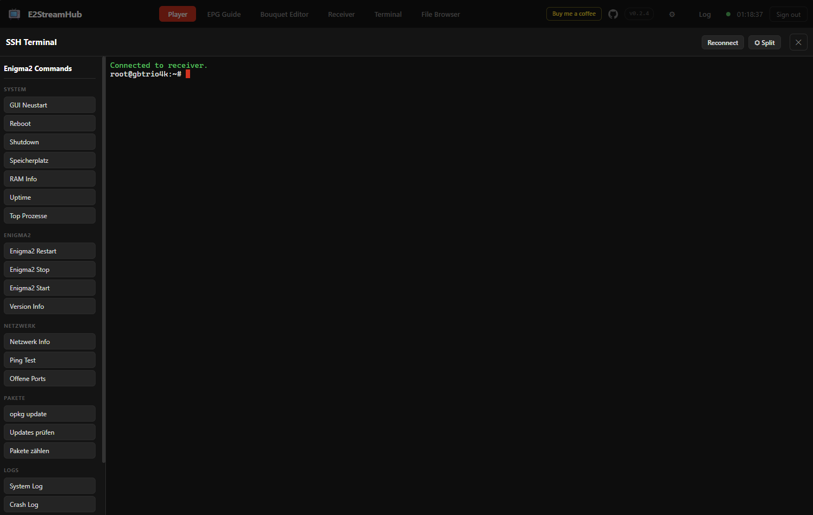
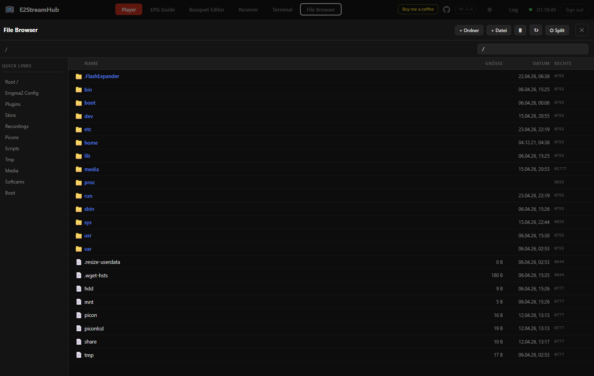

<div align="center">

# 📺 E2StreamHub

**A slick, self-hosted web interface for your Enigma2 satellite receiver**

Stream live TV, browse the EPG, manage bouquets, control your receiver, run SSH commands, and browse files — all from any browser on your network.

[](https://hub.docker.com/r/gomble59/e2streamhub)
[](https://hub.docker.com/r/gomble59/e2streamhub)
[](#%EF%B8%8F-tech-stack)
[](#)

<br/>

> Works with **Gigablue**, **Dreambox**, **VU+**, **Formuler** and any other Enigma2 receiver running [OpenWebif](https://github.com/E2OpenPlugins/e2openplugin-OpenWebif).

<br/>

[](https://www.buymeacoffee.com/gomble)

</div>

---

## 📸 Screenshots

<table>
  <tr>
    <td align="center"><b>Live TV Player</b></td>
    <td align="center"><b>Recordings Playback</b></td>
  </tr>
  <tr>
    <td></td>
    <td></td>
  </tr>
  <tr>
    <td align="center"><b>EPG Guide</b></td>
    <td align="center"><b>Bouquet Editor</b></td>
  </tr>
  <tr>
    <td></td>
    <td></td>
  </tr>
  <tr>
    <td align="center"><b>Receiver Control</b></td>
    <td align="center"><b>SSH Terminal</b></td>
  </tr>
  <tr>
    <td></td>
    <td></td>
  </tr>
  <tr>
    <td align="center"><b>File Browser</b></td>
    <td></td>
  </tr>
  <tr>
    <td></td>
    <td></td>
  </tr>
</table>

---

## ✨ Features

### 📡 Live Streaming
- **Fragmented MP4 via MSE** — primary mode, works on all modern browsers including iOS Safari 13+
- **HLS fallback** — for older iOS without Media Source Extensions
- **MPEG-TS fallback** — direct stream proxy as last resort
- **IPTV support** — plays embedded HTTP streams directly from type-5001/5002 service refs
- Automatic stream mode selection — no manual configuration needed
- H.264 + AAC re-encoding with `zerolatency` tuning for minimal latency

### 📋 Channel Browser
- Full bouquet & channel list pulled live from your receiver
- Channel picon (logo) display with auto-detection from the receiver's picon directory
- Current EPG title shown inline next to every channel
- Cross-bouquet search with progressive, live results as you type
- Click any channel to start streaming instantly

### 🎬 Recordings Playback
- Browse all recordings stored on the receiver's HDD
- Search recordings by name
- One-click playback via the same fMP4 pipeline
- Full description and metadata shown in the info panel

### 📅 EPG — Electronic Programme Guide
- **Full TV Guide timeline** with selectable 2 / 3 / 6 / 12 / 24-hour windows
- Scrollable horizontal timeline — browse past, present and future at once
- Navigate by bouquet; jump back to "Now" with one click
- Click any programme to open the **Detail modal**:
  - Full title, short & long description
  - Start/end times, duration, live progress bar
  - Tune directly to the channel from the modal
- Background EPG preload for instant availability

### ✏️ Bouquet Editor
- **Drag-and-drop channel reordering** powered by Sortable.js
- Add channels from any bouquet via a live search panel
- Remove channels, add section markers / dividers
- Rename bouquets and create new ones from scratch
- Changes are saved back to the receiver automatically (with 2-second debounce)
- Triggers an Enigma2 service list reload — no reboot required

### 🛰️ Receiver Control Panel

| Section | What you can do |
|---|---|
| **Info** | Model, image version, Enigma2 / kernel / WebIF versions, tuner names, network IPs, HDD usage |
| **Signal** | Live SNR bar (dB), AGC %, BER counter — refreshes every 5 s |
| **Power** | Standby, Reboot, Deep Standby, GUI Restart (all with confirmation) |
| **Volume** | +/− 5% buttons, click-to-set bar, mute toggle — live sync with receiver |
| **Sleep Timer** | Set duration & action (standby / deep standby), enable / disable |
| **Remote Control** | Full virtual remote — navigation, colour keys, media controls, teletext, EPG |
| **Send Message** | Push a text overlay to the receiver's screen with type and timeout |
| **Timers** | List, toggle, delete timers; bulk-clean expired recordings |
| **Settings** | Browse all Enigma2 settings as a searchable key-value list |

### 💻 SSH Terminal
- **Full browser-based terminal** powered by [xterm.js](https://xtermjs.org/) over WebSocket
- Connects directly to your receiver via SSH — no separate tools needed
- **Command panel** with one-click Enigma2 shortcuts: GUI restart, Enigma2 stop/start, network info, package management, log viewers, and more
- **Split-screen mode** — terminal and file browser side-by-side

### 📁 File Browser
- Browse the receiver's filesystem over SFTP
- **Quick links** to common paths: Root, Enigma2 Config, Plugins, Skins, Recordings, Picons, Scripts, Media, Softcams, Boot
- Upload, download, rename, delete files and folders
- **Inline text editor** — open and edit config files directly in the browser
- Context menu (right-click) for all file operations
- **Split-screen mode** — file browser alongside the SSH terminal

### ⚙️ App Settings
- Change login username and password
- **Two-Factor Authentication (TOTP)** — QR-code setup, works with Google Authenticator, Authy, etc.
- Receiver connection settings (host, ports, credentials, stream auth)
- ffmpeg tuning: transcode preset, probesize, analyzeduration
- HLS fallback tuning: segment duration, playlist depth
- All settings persist across container restarts via `data/config.json`

### 🔒 Security
- Session-based auth with 24-hour timeout
- TOTP 2FA with ±1 time-step tolerance
- HTTP Basic Auth support for the receiver's stream port
- Configurable session signing secret

### 📱 Mobile Support
- Fully optimised for phones and tablets
- Hamburger navigation menu on small screens
- Channel sidebar as a slide-in overlay on mobile
- Receiver remote control scaled for touch
- All overlays (EPG, Editor, Receiver, Terminal, File Browser) work on mobile

### 🖥️ Quality of Life
- **Live Server Log** — real-time SSE stream, colour-coded by level, in a slide-out panel
- **Picture-in-Picture** — draggable & resizable floating player, stays visible across all views
- **Web-based Setup Wizard** — guided first-launch configuration, no manual config files needed
- **Response compression** — gzip on all API responses for fast loading on slow networks
- **Donation reminder** — periodic popup (every 48 h) with a Buy Me a Coffee link to support the project
- **API caching** — bouquets (2 min), services (2 min), EPG (30 s) to avoid hammering the receiver

---

## 🚀 Quick Start

### Option 1 — Docker Hub (recommended)

The easiest way. No build step required — the image is pulled directly from Docker Hub.

```bash
docker run -d \
  --name e2streamhub \
  -p 2000:2000 \
  -v e2streamhub-data:/app/data \
  --tmpfs /app/hls-sessions:size=128m \
  --restart unless-stopped \
  gomble59/e2streamhub:latest
```

Then open **`http://YOUR-SERVER-IP:2000`** — the setup wizard guides you through the rest.

### Option 2 — Docker Compose

```bash
# 1. Download the compose file
curl -O https://raw.githubusercontent.com/gomble/E2StreamHub/master/docker-compose.yml

# 2. Start
docker compose up -d

# 3. Open
http://YOUR-SERVER-IP:2000
```

### Option 3 — Build locally

```bash
git clone https://github.com/gomble/E2StreamHub.git
cd E2StreamHub
docker compose up -d --build
```

On first launch the **setup wizard** walks you through connecting to your receiver. Nothing else needed.

---

## 🐳 Docker Compose

```yaml
services:
  e2streamhub:
    image: gomble59/e2streamhub:latest
    # To build locally instead of pulling from Docker Hub, uncomment below:
    # build: .
    container_name: e2streamhub
    ports:
      - "2000:2000"
    environment: {}   # Leave empty → setup wizard on first launch
    # To skip the wizard, uncomment and fill in these variables:
    # environment:
    #   - ENIGMA2_HOST=192.168.1.100
    #   - ENIGMA2_PORT=80
    #   - ENIGMA2_STREAM_PORT=8001
    #   - ENIGMA2_SSH_PORT=22
    #   - ENIGMA2_USER=
    #   - ENIGMA2_PASSWORD=
    #   - APP_USERNAME=admin
    #   - APP_PASSWORD=admin
    #   - SESSION_SECRET=please-change-this-to-a-random-32-char-string
    #   - FFMPEG_FORCE_VIDEO_TRANSCODE=false
    #   - FFMPEG_PROBESIZE=10000000
    #   - FFMPEG_ANALYZEDURATION=10000000
    #   - FFMPEG_TRANSCODE_PRESET=veryfast
    #   - HLS_SEGMENT_SECONDS=2
    #   - HLS_LIST_SIZE=4
    volumes:
      - e2streamhub-data:/app/data
    tmpfs:
      - /app/hls-sessions:size=128m
    restart: unless-stopped
    # network_mode: host   # Linux only — use if container can't reach the receiver

volumes:
  e2streamhub-data:
```

> **Network tip:** If the container can't reach the receiver, add `network_mode: host` (Linux only).

---

## 🔧 Configuration

All settings are available through the in-app **Settings panel** (⚙ button). Environment variables always override saved settings.

| Variable | Default | Description |
|---|---|---|
| `ENIGMA2_HOST` | `192.168.1.100` | Receiver IP or hostname |
| `ENIGMA2_PORT` | `80` | OpenWebif HTTP port |
| `ENIGMA2_STREAM_PORT` | `8001` | Enigma2 stream source port |
| `ENIGMA2_SSH_PORT` | `22` | SSH port (required for SSH Terminal & File Browser) |
| `ENIGMA2_USER` | *(empty)* | OpenWebif / SSH username |
| `ENIGMA2_PASSWORD` | *(empty)* | OpenWebif / SSH password |
| `ENIGMA2_STREAM_AUTH` | `false` | Send HTTP Basic Auth on stream requests |
| `APP_USERNAME` | `admin` | E2StreamHub login username |
| `APP_PASSWORD` | `admin` | E2StreamHub login password — **change this!** |
| `SESSION_SECRET` | *(auto-generated)* | Session signing key — **change this!** |
| `FFMPEG_FORCE_VIDEO_TRANSCODE` | `false` | Always re-encode video (for HEVC/H.265 sources) |
| `FFMPEG_TRANSCODE_PRESET` | `veryfast` | H.264 preset: `ultrafast` → `medium` |
| `FFMPEG_PROBESIZE` | `10000000` | ffmpeg input probe buffer size |
| `FFMPEG_ANALYZEDURATION` | `10000000` | ffmpeg stream analysis depth |
| `HLS_SEGMENT_SECONDS` | `2` | HLS segment duration (iOS fallback) |
| `HLS_LIST_SIZE` | `4` | HLS playlist buffer depth |
| `PORT` | `2000` | HTTP port the server listens on |

---

## 🏗️ How It Works

```
Browser
  │
  │  GET /stream-fmp4?sRef=...
  │
  ▼
E2StreamHub (Node.js / Express)
  │
  ├─ 1. extractIptvUrl()   → IPTV channel? use embedded HTTP URL directly
  │
  ├─ 2. resolveSptsUrl()   → ask receiver /web/stream.m3u for SPTS URL
  │
  └─ 3. buildSourceUrl()   → fallback to raw MPTS on the stream port
              │
              ▼
          ffmpeg
            reads MPEG-TS → H.264 + AAC → Fragmented MP4 → pipe:1
                                                               │
Browser ◄──────────────── chunked HTTP ◄───────────────────────┘
  MediaSource API
  SourceBuffer.appendBuffer()
  videoEl.play()
```

**Streaming priority:**
1. **fMP4 via MSE** — lowest latency, works everywhere including iOS 13+
2. **HLS** — segment-based fallback for old iOS
3. **MPEG-TS** — raw stream proxy, last resort

**SSH Terminal & File Browser** connect to the receiver via WebSocket → ssh2 → SSH/SFTP on port 22.

**Bouquet/picon file access fallback chain:**
1. OpenWebif HTTP file API
2. SSH / SFTP
3. Enigma2 `/etc/enigma2/settings` lookup

---

## 🛠️ Tech Stack

| Layer | Technology |
|---|---|
| Backend | Node.js 20, Express 4, axios, ssh2, ws, compression |
| Transcoding | ffmpeg — H.264 + AAC → fMP4 |
| Frontend | Vanilla HTML5 / CSS3 / JavaScript (no frameworks) |
| Video Playback | MSE (native), mpegts.js, hls.js |
| SSH Terminal | xterm.js + WebSocket |
| Drag & Drop | Sortable.js |
| Container | Docker — node:20-alpine + ffmpeg |

---

## 📋 Requirements

- **Docker** and **Docker Compose**
- An Enigma2 receiver with **OpenWebif** installed and reachable on the network
- SSH enabled on the receiver (for Terminal & File Browser features)
- Port `2000` accessible on the host (configurable)

---

## 🔄 Updating

```bash
docker compose pull && docker compose up -d
```

Or with `docker run`:

```bash
docker pull gomble59/e2streamhub:latest
docker stop e2streamhub && docker rm e2streamhub
# re-run the docker run command from Quick Start
```

Your config and data are stored in the `e2streamhub-data` volume and are preserved across updates.

---

## ☕ Support the project

If E2StreamHub is useful to you, a coffee keeps development going!

[](https://www.buymeacoffee.com/gomble)

---

<div align="center">
<sub>Made with ❤️ for the Enigma2 community</sub>
</div>
